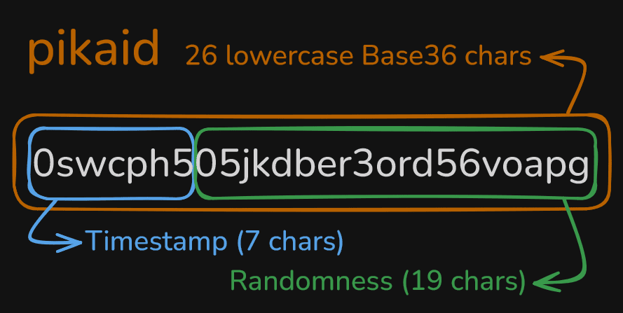

  

# Pikaid Specifications *v1.0.1*

> Small · Sortable · Secure IDs
> 
## Introduction

**Pikaid** *(pronounced “Pika ID”)* is a **26-character**, **lowercase Base36** identifier designed to be:

* **Small**: same length as ULID (26 chars) but more entropy-packed.
* **Sortable**: lexicographically ordered by creation timestamp without extra fields.
* **Secure**: 96 bits of cryptographic randomness to make collisions practically impossible.

Use pikaid when you need a modern alternative to UUID or ULID that is equally compact, more entropy-rich, and uses a standard, familiar alphabet.

## 1. Identifier Structure

* **Timestamp (7 chars)**: seconds since 1970-01-01T00:00:00Z (UTC), Base36-encoded and left-padded to 7 chars.
* **Randomness (19 chars)**: 96 bits from a cryptographically secure generator, Base36-encoded and left-padded to 19 chars.

### 1.1 Binary Layout (BINARY(17))

Pikaid also has a **compact 17-byte binary representation** for storage efficiency and high-performance indexing in databases.

**Layout (big-endian):**

| Byte Range | Description           | Size | Notes                                   |
|------------|----------------------|-------|-----------------------------------------|
| `0..4`     | Timestamp (seconds)  | 5 B   | Unsigned 40-bit integer, big-endian     |
| `5..16`    | Randomness (entropy) | 12 B  | 96 bits of cryptographically secure data |

- **Ordering guarantee**: Binary lexicographic order equals chronological order by second.
- **Compatibility**: The binary form is a 1:1 mapping of the 26-character string and supports round-trip conversion.
- **Timestamp range**: Fully supports the same range as the string form — up to year ~4463 (matching the 7-character base36 timestamp).
- **Randomness**: Always 12 bytes (96 bits), exactly matching the entropy in the string form.

## 2. Why Each Design Decision?

### 2.1 Alphabet: Standard Base36, Lowercase

* **Decision**: use `0–9` and `a–z`, all lowercase.
* **Rationale**: every developer knows Base36; no custom lookup tables; consistent with hex defaults.
* **Benefit**: Pikaid values sort correctly in any database (MySQL, MariaDB, PostgreSQL, etc.) using native lexicographical ordering—no casting or extra functions needed.

### 2.2 Timestamp Length: 7 Characters

* **Decision**: 7 Base36 chars representing seconds since epoch UTC, left padded.
* **Rationale**: seconds precision for accurate sort order; 7 chars covers up to year \~4463, far beyond any foreseeable need. Left padded to keep proper sorting.

### 2.3 Randomness: 96 Bits

* **Decision**: 12 bytes → exactly 96 bits of entropy, encoded in 19 Base36 chars.
* **Rationale**: 2⁹⁶ ≈ 7.9×10²⁸ possibilities; collision birthday bound ≈2⁴⁸ (\~2.8×10¹⁴ IDs) is far beyond realistic generation rates.

### 2.4 No Separators or Checksum

* **Decision**: a continuous 26-char string without dashes or extra checks.
* **Rationale**: minimal overhead; 96-bit entropy makes accidental valid-typo collisions virtually zero.

### 2.5 Implicit Versioning by Length

* **Decision**: rely on total length (26) to identify v1. Eventual future versions with different bit budgets will simply differ in length.
* **Rationale**: avoids in-band flags; parser distinguishes by known lengths.

## 3. Parsing & Validation

To parse a pikaid string:

1. **Length check**: must be exactly 26 chars.
2. **Character check**: match `/^[0-9a-z]{26}$/`.
3. **Split**: first 7 chars = timestamp, next 19 chars = randomness.
4. **Decode timestamp**: Base36 → integer ms → timestamp object.
5. **Error**: throw or reject on any invalid input.

## 4. Why Choose pikaid Over Others?

* **Compactness**: 26 chars vs 36 for UUID, equal to ULID.
* **Entropy**: 96 bits vs 80 bits for ULID, 122 bits for UUIDv4 (but UUIDv4 is not sortable).
* **Alphabet**: standard Base36 vs custom/Base32 (ULID) or hex+dashes (UUID).
* **Sortability**: built-in timestamp prefix vs UUIDv1’s interleaved timestamp or UUIDv7.
* **URL Safety & Universal Compatibility**: only lowercase alphanumeric ensures natural safety in URLs, filenames, QR codes, and JSON, with pure implementations possible in any language (PHP, JS, Python, Go, etc.) without external dependencies.
* **Implementation Simplicity**: minimal spec, no separators or checksums, easy to implement and maintain across different environments.

## 5. Comparison Table

| Format     | Length | Sortable | Random Bits | Alphabet           | Valid Until (ms) | Notes                                    |
| ---------- | :----: | :------: | :---------: | ------------------ | ---------------- | ---------------------------------------- |
| **pikaid** |   26   |   Yes    |     96      | Base36 (lowercase) | \~year 4463      | Compact, high entropy, standard alphabet |
| UUIDv1     |   36   |   Yes    |     14      | hex + dashes       | N/A              | low randomness, MAC-based                |
| UUIDv4     |   36   |    No    |     122     | hex + dashes       | N/A              | high entropy, not time-sortable          |
| UUIDv6     |   36   |   Yes    |     62      | hex + dashes       | N/A              | reordered-v1, moderate entropy           |
| UUIDv7     |   36   |   Yes    |     74      | hex + dashes       | N/A              | timestamp + random, standardizing trend  |
| ULID       |   26   |   Yes    |     80      | Crockford Base32   | \~year 10889     | sortable, less randomness, custom set    |
| NanoID     |   21   |    No    |    \~128    | custom 64-char set | N/A              | very high entropy, not sorted by time    |

*Please refer to individual specs for exact entropy calculations and alphabet details.*

---

## **Conclusion**

With these **clear, language-agnostic rules** and a **simple, consistent design**, any implementation — in **PHP, JavaScript, Python, Go, Rust**, or any other language — can generate and consume **pikaid** values that are **fully interoperable** across platforms, databases, and services.

**Pikaid** delivers the perfect balance of being **compact**, **sortable**, and **secure**, making it a **modern, reliable replacement** for UUID and ULID in production systems.

---

# Extra

## Benchmark

### PHP 60k iterations

| Library    | Implementation        | Median µs/op | Ratio |
| :--------- | :-------------------- | -----------: | -----: |
| **Pikaid** | **pikaid/pikaid-php** | **0.9**      | **1.0** |
| NanoID     | hidehalo/nanoid-php   | 2.1          | 2.4     |
| ULID       | robinvdvleuten/ulid   | 2.0          | 2.4     |
| UUIDv1     | ramsey/uuid           | 5.0          | 5.9     |
| UUIDv4     | ramsey/uuid           | 1.3          | 1.6     |
| UUIDv6     | ramsey/uuid           | 5.4          | 6.4     |
| UUIDv7     | ramsey/uuid           | 2.7          | 3.2     |
> **Benchmark context**  
> - 30 passes × 60,000 iterations per subject  
> - Warm-up per subject: 60,000 iterations  
> - PHP 8.3.6 with `ext-gmp` enabled  
> - CPU: AMD Ryzen 7 5800X, 32 GB DDR4 3200 MHz  
> - OS: Microsoft Windows 11 Pro 23H2 (build 22631)
